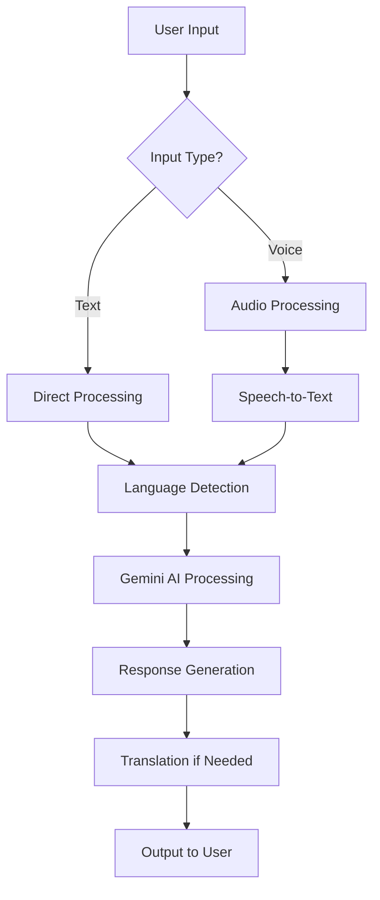

# **Bilingual Programming Tutor - Technical Documentation**

---

## **1. Overview**
The **Bilingual Programming Tutor** is a Streamlit web application that provides programming assistance with real-time language translation capabilities. It combines:
- **Google's Gemini AI** for technical responses
- **Speech-to-text** for voice input
- **Language translation** (10+ languages supported)
- **Technical term preservation** in code examples

---

## **2. Key Features**

### **2.1 Core Functionality**
| Feature | Description |
|---------|-------------|
| **Multilingual Support** | Answers in 10+ languages while preserving technical terms |
| **Speech Recognition** | Voice input with audio playback |
| **Context-Aware Responses** | Maintains conversation history for coherent answers |
| **Code Preservation** | Keeps code snippets in original English |
| **Temperature Control** | Adjusts response creativity (0.0-1.0) |

### **2.2 Technical Components**
| Component | Technology Used |
|-----------|----------------|
| **AI Backend** | Google Gemini 2.0 Flash |
| **Speech-to-Text** | `speech_recognition` + `pydub` |
| **Translation** | `googletrans` |
| **Frontend** | Streamlit |
| **Audio Processing** | `audio-recorder-streamlit` |

---

## **3. Architecture**



---

## **4. Setup Guide**

### **4.1 Installation**
```bash
pip install -r requirements.txt
```

**Required Packages:**
```text
streamlit
google-generativeai
googletrans==4.0.0-rc1
speechrecognition
pydub
audio-recorder-streamlit
soundfile
```

### **4.2 Configuration**
1. Create `.env` file:
   ```env
   API_KEY=your_gemini_api_key
   ```
2. For Windows users:
   ```powershell
   # Install additional dependencies
   pip install pyaudio-win
   ```

---

## **5. File Structure**

```
chat-genv/
├── app.py                # Main application
├── functions.py          # Core utilities
├── requirements.txt      # Dependencies
└── .env                  # Environment variables
```

---

## **6. Core Functions**

### **6.1 `functions.py` Highlights**

```python
def transcribe_audio(audio_bytes: bytes) -> Optional[str]:
    """Converts audio bytes to text without temp files"""
    # Uses in-memory processing for Windows compatibility

def reset_chat(complete_reset=True):
    """Cleans chat history and audio files"""
    # Handles session state cleanup

def get_secret(key: str) -> Optional[str]:
    """Secure credential management"""
    # Works with both Streamlit Secrets and .env
```

---

## **7. Troubleshooting Guide**

| Error | Solution |
|-------|----------|
| **Audio processing failed** | 1. Check mic permissions<br>2. Run `windows_audio_setup()`<br>3. Try fallback in `transcribe_audio()` |
| **Missing API key** | Verify `.env` or Streamlit Secrets |
| **Speech recognition fails** | 1. Speak clearly<br>2. Reduce background noise<br>3. Increase `pause_threshold` |
| **Translation errors** | Check internet connection |

---

## **8. Deployment Options**

### **8.1 Streamlit Sharing**
```bash
streamlit run app.py
```

### **8.2 Docker**
```dockerfile
FROM python:3.9
COPY . /app
WORKDIR /app
RUN pip install -r requirements.txt
CMD ["streamlit", "run", "app.py"]
```

---

## **9. Extensibility**

**Potential Enhancements:**
1. Add more languages to `LANGUAGES` dictionary
2. Implement technical glossary expansion
3. Add code execution sandbox
4. Include screenshot-based debugging

---

## **10. License**
MIT License - Free for educational and commercial use

---

**Maintainer**: [Clifford Ojuka]  
**Version**: 1.1.0  
**First Update**: 2025-05-04  

For support, please open an issue on GitHub.